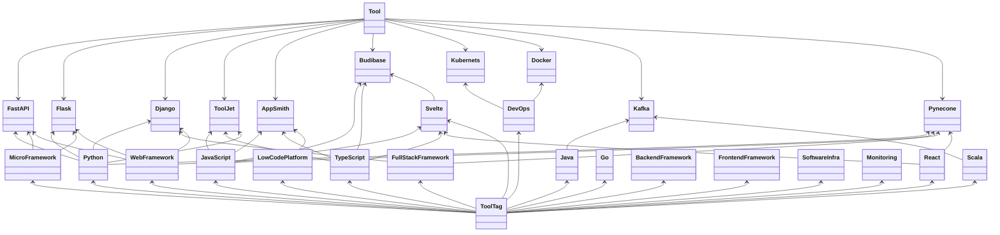

# mydevenv

## default `.env`
```dotenv
ENV=dev
JWT_SECRET_KEY=mydevenv
```

## dispose Tool and ToolTag Relation

```mermaid
classDiagram
Tool --> FastAPI
Tool --> Flask
Tool --> Django
Tool --> ToolJet
Tool --> AppSmith
Tool --> Budibase
Tool --> Kubernets
Tool --> Docker
Tool --> Kafka
Tool --> Pynecone


FastAPI <-- Python
FastAPI <-- MicroFramework
FastAPI <-- WebFramework
Flask <-- Python
Flask <-- MicroFramework
Flask <-- WebFramework
Django <-- Python
Django <-- FullStackFramework
Django <-- WebFramework
Pynecone <-- Python
Pynecone <-- FullStackFramework
Pynecone <-- WebFramework
Pynecone <-- React
ToolJet <-- JavaScript
ToolJet <-- TypeScript
ToolJet <-- Python
AppSmith <-- JavaScript
AppSmith <-- TypeScript
AppSmith <-- LowCodePlatform
Budibase <-- JavaScript
Budibase <-- TypeScript
Budibase <-- Svelte
Kafka <-- Java
Kafka <-- Scala
Svelte <-- JavaScript
Svelte <-- TypeScript
Svelte <-- React
Docker <-- DevOps
Kubernets <-- DevOps


Python              <-- ToolTag
JavaScript          <-- ToolTag
TypeScript          <-- ToolTag
Java                <-- ToolTag
Scala               <-- ToolTag
Go                  <-- ToolTag

WebFramework        <-- ToolTag
MicroFramework      <-- ToolTag
FullStackFramework  <-- ToolTag
BackendFramework    <-- ToolTag
FrontendFramework   <-- ToolTag

LowCodePlatform     <-- ToolTag
DevOps              <-- ToolTag

SoftwareInfra       <-- ToolTag
Monitoring          <-- ToolTag
Svelte              <-- ToolTag
React               <-- ToolTag

```
