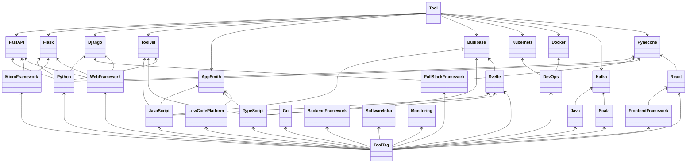

# mydevenv

## default `.env`
```dotenv
ENV=dev
JWT_SECRET_KEY=mydevenv
```

## dispose Tool and ToolTag Relation

클래스 다이어그램을 한번 그려봤는데 RDBMS로 구현하면 지옥이 펼쳐질 것 같음.
예를 들어 Budibase같은 경우 LowCodePlatform이지만 그 자체로도 Tool이고,
React또한 Javascript로 작성된 FrontendFrameworkd이자 그 자체로도 Tool의 범주에 포함될 수 있음.


그러니까 결국 `Tool` N:N `ToolTag`로 완전히 표현할 수가 없고
`Tool`이 자기 자신을 N으로 재귀참조하는 형태의 자료구조가 돼야한다.
